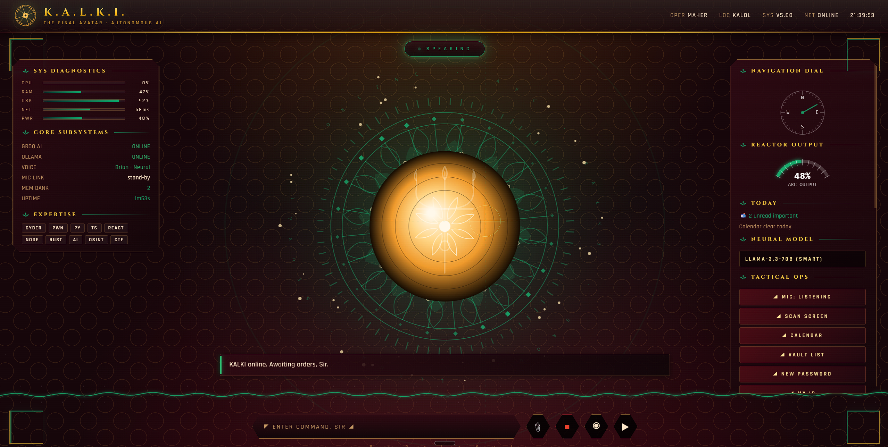
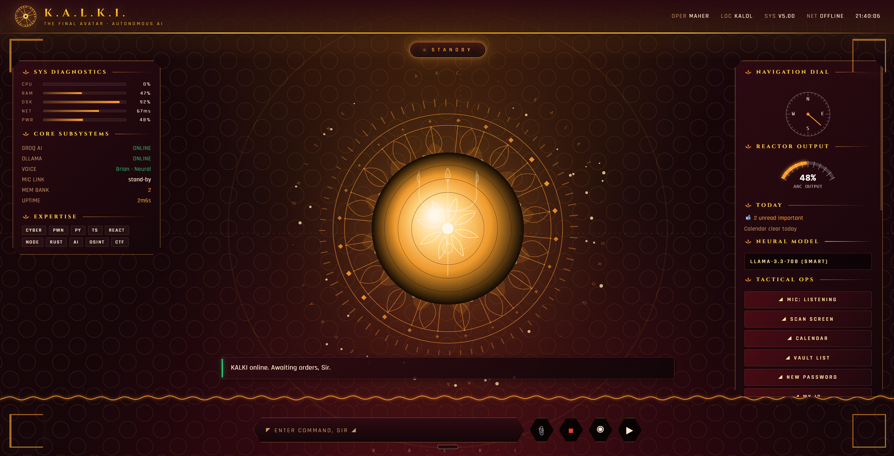
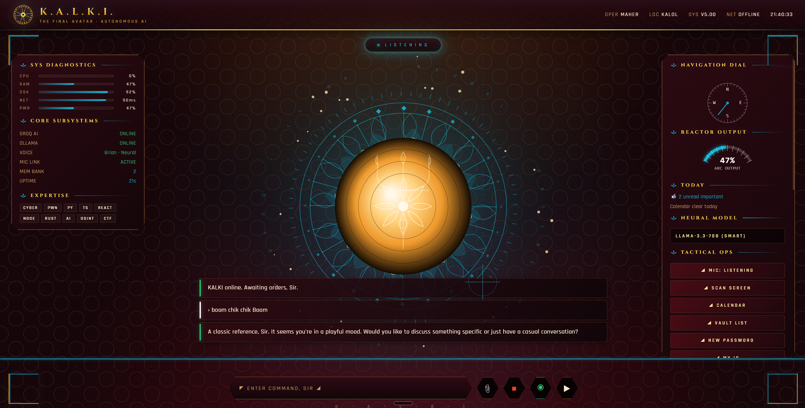

# K.A.L.K.I.
### *The Final Avatar · Autonomous AI*

A Windows-native, voice-first AI personal assistant inspired by JARVIS from Iron Man — built from scratch in Python and a single HTML file. Named after Kalki, the final avatar of Vishnu.

Lives quietly in the background. Wakes on **"Hey KALKI"**. Speaks in a natural neural voice. Manages your day, runs your code, hacks your hashes, scans websites for vulnerabilities, and reads your calendar — all through one Iron Man-style HUD.



> The HUD is **state-reactive** — the whole interface retunes its colour as KALKI idles, listens, thinks, and speaks:

| Idle (saffron) | Listening (peacock) |
|:---:|:---:|
|  |  |

---

## Highlights

- 🎙 **Voice-first, always-on** — "Hey KALKI" wake word; cloud STT, with an optional **offline Vosk** engine. Built-in-mic selection keeps Bluetooth headsets in high-quality A2DP.
- 🧠 **Smart model routing** — casual turns use a fast 8B model, code/cyber turns use LLaMA-3.3-70B. **Offline fallback** to a local Ollama model.
- 🔐 **Web vulnerability scanner** — *"scan this website"* reads your open browser tab, audits TLS / headers / cookies / CORS / exposed files / dangerous methods, pulls the source + JS, hunts leaked secrets, maps the form/injection surface, and runs active reflected-XSS / open-redirect checks. Non-destructive, findings + fixes.
- 🛰 **Site Watchdog** — background monitor for your sites: down/recovered alerts + SSL-expiry warnings (14/7/2 days).
- 📋 **Clipboard genie** — *"decode my clipboard"* auto-detects JWT / base64 / hex / hashes.
- 🌅 **Morning security brief** — new critical CVEs relevant to your stack + watched-site status.
- 🎨 **Indian "Mahal" HUD** — maroon + gold, jali lattice, an Ashoka-chakra / lotus / Surya mandala reactor, rangoli accents.

---

## Features

### Voice & Intelligence
- **Always-on wake-word** — say "Hey KALKI" from anywhere; works even when the browser tab is closed
- **Voice-only operation** — listener captures the follow-up sentence after wake; no clicks needed
- **Groq-powered brain** — `llama-3.3-70b-versatile` for thinking, `llama-4-scout` for vision
- **Neural TTS** — Microsoft edge-tts `en-GB-RyanNeural` (the closest thing to the movie voice)
- **Stop command** — say "stop" anywhere and the audio cuts instantly

### Personal Assistant
- **Google Calendar** — speaks today's + tomorrow's events on every boot
- **Auto event reminders** — KALKI warns you 15 minutes before every meeting, unprompted
- **Gmail (Primary filter)** — reads only important unread mail; ignores promotions, social, updates, forums, spam
- **Tasks + reminders** — natural-language "remind me to X in 10 minutes" / "at 5 PM"
- **Notes + journal** — "take a note", "what did I note yesterday", `#tags` parsed automatically
- **Password vault** — DPAPI-encrypted (Windows user-account locked, no master password)
- **WhatsApp messaging** — "send a WhatsApp to Dev saying I'll be late" (via pywhatkit)
- **Spotify control** — "play lo-fi", "next song", "pause", "what's playing"; auto-launches if not running
- **Workflow modes** — "study mode", "gaming mode", "CTF mode" trigger multi-step action chains

### Cybersecurity Toolkit
- **Hashes** — identify, generate (MD5/SHA1/SHA256/SHA512/SHA3/NTLM/MD4), and dictionary-crack
- **Encode/decode** — base64, hex, URL, rot13, binary, morse
- **CVE intel** — `lookup CVE-2024-3094` (NVD API) and "recent critical CVEs" (last 30 days, newest first)
- **Subdomain enumeration** — via crt.sh with hackertarget.com fallback
- **GitHub dorking** — pre-baked search URLs for AWS keys, API keys, passwords, .env files, SSH keys
- **Reverse shell payloads** — Bash, sh, Python, Python3, PowerShell, nc, mkfifo, PHP, Perl, Ruby
- **Port scan / DNS / HTTP headers / WHOIS / ping** — fast TCP probe of the standard 42 ports
- **WiFi password recovery** — own networks via `netsh wlan show profile`
- **Screen vision** — Groq vision API analyzes screenshots ("look at my screen and solve this")

### Vision & File Upload
- **Click 📎, drag-and-drop anywhere, or paste Ctrl+V** to attach images / code / text
- Images go to Groq vision for analysis (CTF challenges, code screenshots, error dialogs)
- Text/code files are prepended to your message so the AI sees full content

### Code Engine
- **"Write and run a Python script that scans port 80 on 10 IPs"** — generates, saves, executes
- Python, PowerShell, Batch, Node, HTML
- Scripts saved to `data/scripts/` with timestamps

### Proactive Alerts (background)
- **Battery** — speaks unprompted at <20% and <10%
- **CPU** — sustained high (>95% for 3 consecutive checks)
- **RAM** — over 90%
- All alerts have cooldowns (8–25 minutes) to avoid spam

### The HUD
- **Arc reactor center** — 60fps canvas, 72 mic-reactive frequency bars, 32 orbiting particles, 12 hex cells, 6 petal flares, rotating text rings ("KALKI · GROQ · LLAMA · NEURAL"), pulse ring on state change
- **State-reactive theme** — entire UI shifts hue when KALKI is idle/listening/thinking/speaking (panels, brand mark, readout stripes all retune)
- **Live HUD panels** — CPU/RAM/disk/network/power bars, today's calendar, unread mail count, now-playing track, scrolling telemetry stream
- **Code blocks with copy button** — KALKI replies with triple-backtick fences; UI renders them in monospace with a one-click COPY chip
- **No "asterisk asterisk" in TTS** — markdown stripped before speaking

---

## Architecture

```
                ┌─────────────────────────┐
                │   index.html (the HUD)  │
                │   Canvas + JS + CSS     │
                └──────────┬──────────────┘
                           │ /api/* HTTP+JSON
                           ▼
   ┌───────────────────────┴──────────────────────────┐
   │                  server.py                       │
   │  http.server + ThreadingMixIn (stdlib only)      │
   │  - intent router (local commands)                │
   │  - background loops (alerts, calendar, reminders)│
   │  - voice TTS pipeline                            │
   └─┬──┬──┬──┬──┬──┬──┬──┬──┬──┬──┬──┬──┬──┬──┬───────┘
     │  │  │  │  │  │  │  │  │  │  │  │  │  │  │
   vault gcal vision coder spotify whatsapp notes tasks
   cybertools  workflows  mail  ytdl
                           ▲
                           │ POST /api/wake|chat|stop
                           │
                ┌──────────┴──────────────┐
                │      listener.py        │
                │  SpeechRecognition+PyAudio
                │  cycles mic, fuzzy match│
                └─────────────────────────┘

   launcher.py (silent boot, registers HKCU\...\Run)
```

**Why stdlib only for the server?** No Flask, no FastAPI, no npm — KALKI depends on `python -m http.server`'s threading model and a single HTML file. Easier to audit, faster to start, runs forever without a build step.

---

## Project Structure

```
C:\Kalki\
├── server.py            ← HTTP API + intent router + background loops
├── listener.py          ← Always-on wake word + follow-up listener
├── launcher.py          ← Silent boot + Windows autostart
├── config.py            ← All keys & settings (gitignored)
├── config.example.py    ← Template — copy to config.py and fill in
├── index.html           ← The Iron Man HUD (canvas + vanilla JS)
├── requirements.txt     ← pip dependencies
├── INSTALL.bat          ← One-click installer
├── START.bat            ← Manual launch (with console for debugging)
│
│   ── Modules ──
├── vault.py             ← DPAPI password store
├── cybertools.py        ← Hashes, codecs, network, CVE, recon, payloads
├── vision.py            ← Screenshot / image analysis via Groq vision
├── coder.py             ← Code generation + execution sandbox
├── tasks.py             ← Tasks + reminders (with time parsing)
├── notes.py             ← Notes + journal with full-text search
├── mail.py              ← IMAP Gmail reader (alt to OAuth)
├── gcal.py              ← Google Calendar + Gmail OAuth
├── spotify_mod.py       ← Spotify Web API control
├── whatsapp_mod.py      ← pywhatkit-based messaging
├── workflows.py         ← Multi-step modes (study/gaming/ctf/...)
├── ytdl.py              ← yt-dlp wrapper
│
│   ── One-time setup scripts ──
├── setup_google.py      ← Google OAuth authorize
├── setup_spotify.py     ← Spotify OAuth authorize
│
└── data/                ← Local state (gitignored)
    ├── memory.json
    ├── history.json
    ├── tasks.json
    ├── reminders.json
    ├── notes.json
    ├── vault.json           (DPAPI-encrypted)
    ├── google_token.pickle  (OAuth cache)
    ├── spotify_token.json
    ├── contacts.json
    └── scripts/             (generated by /api/code/generate)
```

---

## Setup

### Requirements
- **Windows 10/11**
- **Python 3.11** — install from [python.org](https://www.python.org/downloads/release/python-3119/) and tick **"Add Python to PATH"**
- A **microphone**
- A **free Groq API key** (the only thing that's required — takes 1 minute)

---

### Step 1 — Get your free Groq API key  *(required)*

KALKI's brain runs on [Groq](https://console.groq.com) (free, very fast LLaMA inference).

1. Go to **<https://console.groq.com>** and sign in (Google login works).
2. In the left menu open **API Keys**.
3. Click **Create API Key**, give it a name (e.g. `kalki`), and **Create**.
4. **Copy the key** — it looks like `gsk_xxxxxxxxxxxxxxxxxxxx`. You only see it once, so copy it now.

> 🔒 This key is yours. Keep it private — anyone with it can use your Groq quota.

---

### Step 2 — Download & configure

```bat
git clone https://github.com/Maher-Bhatt/KALKI.git C:\Kalki
cd C:\Kalki
copy config.example.py config.py
```

Open **`config.py`** in any editor and paste your key:

```python
GROQ_API_KEY = "gsk_your_key_here"   # <- paste the key from Step 1
OWNER_NAME   = "YourName"            # how KALKI addresses you
OWNER_CITY   = "YourCity"            # for the weather line
```

> ⚠️ **`config.py` is gitignored** — your keys live only on your machine and are never committed. Never put real keys in `config.example.py`.

---

### Step 3 — Install & run

```bat
INSTALL.bat        :: installs Python dependencies
START.bat          :: launches KALKI
```

Within a couple of seconds you'll hear a greeting, Chrome opens to **`http://localhost:8888`**, and the HUD appears. Say **"Hey KALKI"** to talk to it.

**Auto-start on every boot (optional):**
```bat
py -3.11 launcher.py
```
Registers KALKI under `HKCU\...\Run` + a Startup shortcut so it launches silently each login. To remove, delete the `KALKI_v5` registry value.

---

### Step 4 — Optional integrations

All optional — KALKI works fully without them.

| Integration | How to set up |
|---|---|
| **Google Calendar + Gmail** | At [console.cloud.google.com](https://console.cloud.google.com): create a project → enable **Calendar API** + **Gmail API** → **OAuth consent screen** (External, add your email as a test user) → **Credentials → OAuth client ID → Desktop app** → download the JSON to `data/google_credentials.json` → run `py -3.11 setup_google.py` and approve in the browser. |
| **Spotify** | At [developer.spotify.com/dashboard](https://developer.spotify.com/dashboard): create an app, set redirect URI **`http://127.0.0.1:8889/callback`**, copy the **Client ID + Secret** into `config.py`, then run `py -3.11 setup_spotify.py`. |
| **Offline brain** | Install [Ollama](https://ollama.com) and `ollama pull qwen2.5:7b` — KALKI falls back to it when offline. |
| **Tesseract OCR** (vision text fallback) | Install from the [UB-Mannheim build](https://github.com/UB-Mannheim/tesseract/wiki). |
| **Wordlist** (hash cracking) | Drop a wordlist at `data/wordlist.txt`. |

---

## Voice Command Reference

### Music & Media
| Say | Action |
|---|---|
| "Play lo-fi" | Spotify search + play |
| "Play Believer" | Plays the song |
| "Pause" / "Resume" | Spotify playback |
| "Next song" / "Previous song" | Skip / back |
| "What's playing" | Speaks current track |
| "Spotify volume 50" | Sets Spotify volume |
| "Download this YouTube video <url>" | yt-dlp grab |

### Productivity
| Say | Action |
|---|---|
| "What's on my calendar" | Today's events (falls through to tomorrow if clear) |
| "What's on my calendar tomorrow" | Tomorrow's events |
| "Check my Gmail" | Important unread, Primary tab only |
| "Add task X" / "Show my tasks" | Task management |
| "Remind me to X in 10 minutes" / "at 5 PM" | Time-bound reminder |
| "Take a note Y" / "Show my notes" / "Notes from yesterday" | Notes |
| "Send a WhatsApp to Dev saying I'll be late" | WhatsApp Web message |
| "Add contact Dev +91XXXXXXXXXX" | Save to contacts |

### Cybersecurity
| Say | Action |
|---|---|
| "MD5 of admin123" | Hashes the string |
| "Identify hash <hash>" | Guesses the type by length |
| "Crack hash <hash>" | Dictionary attack against `data/wordlist.txt` |
| "Lookup CVE-2024-3094" | NVD lookup, summary + score |
| "Recent critical CVEs" | Last 30 days |
| "Find subdomains of paypal.com" | crt.sh + hackertarget |
| "GitHub dorks for example.com" | Search URL list |
| "Reverse shell python 10.10.14.5 4444" | Payload in copyable code block |
| "Port scan 192.168.1.1" | Top 42 TCP ports |
| "DNS google.com" / "Headers for example.com" / "Ping 1.1.1.1" | Network recon |
| "Base64 encode <text>" / "Decode base64 <blob>" | Codecs (also hex, URL, rot13, binary, morse) |
| "What's my IP" / "IP info" | Public IP + geolocation |
| "List my WiFi" / "WiFi password for HomeNet" | `netsh` recovery |

### System
| Say | Action |
|---|---|
| "What time is it" / "What date" | Local |
| "Battery" / "System info" | psutil stats |
| "Set volume 60" / "Mute" / "Unmute" | pycaw |
| "Take a screenshot" | Pillow ImageGrab → Desktop |
| "Lock my PC" / "Sleep" / "Restart" / "Shutdown" | Windows commands |
| "Open Chrome" / "Open YouTube" / "Open Documents" | Launches apps/folders |
| "Close Spotify" | psutil kill |

### Vault & Vision
| Say | Action |
|---|---|
| "Save my Gmail password as hunter2" | DPAPI-encrypted vault |
| "What is my Gmail password" | Speaks + displays |
| "List my passwords" | All labels |
| "Generate a strong password" | 20-char random |
| "Look at my screen and solve it" | Screenshot → Groq vision |
| (Drag image into window) "solve this" | Uploaded image → Groq vision |

### Workflow Modes (fuzzy-matched)
| Say | What runs |
|---|---|
| "Study mode" | Opens Code, lo-fi playlist, lowers volume |
| "Gaming mode" | Opens Steam + Discord, kills Chrome |
| "CTF mode" (also "city of mode" — handles mishearings) | Opens Code, terminal, exploit-db, gtfobins |
| "Focus mode" | Lowers volume, kills Discord |
| "Morning routine" | Opens Gmail + Calendar |
| "Shutdown routine" | Closes apps, locks PC |

### Meta
| Say | Action |
|---|---|
| "Stop" / "Shut up" / "Quiet" | Cuts current speech |
| "Pause listener" / "Resume listener" | Frees the mic for other apps |
| "Remember <fact>" / "What do you remember" | Long-term memory |
| "Tell me my details" | Owner profile + memory count |

---

## Tech Stack

| Layer | Tech |
|---|---|
| Server | Python 3.11 stdlib (`http.server` + `ThreadingMixIn`) — no Flask |
| LLM | Groq API (llama-3.3-70b-versatile / llama-4-scout vision) |
| TTS | Microsoft edge-tts + pygame mixer (non-blocking) |
| STT | Python SpeechRecognition + Google STT for the wake word |
| Calendar/Mail | google-api-python-client + google-auth-oauthlib |
| Music | spotipy (Spotify Web API) |
| Messaging | pywhatkit (WhatsApp Web automation) |
| Vault | pywin32 / `win32crypt` (DPAPI) |
| System | psutil, pycaw, pillow, comtypes |
| Recon | crt.sh, NVD API, hackertarget.com, DuckDuckGo HTML |
| Frontend | Vanilla JS + Canvas2D, single `index.html`, no build step |

---

## License

MIT — see [LICENSE](LICENSE).

---

## Acknowledgments

- The vision and the name come from Marvel's Tony Stark. KALKI in the movies = the inspiration.
- [Groq](https://groq.com) for absurdly fast LLaMA inference
- [edge-tts](https://github.com/rany2/edge-tts) for the neural Ryan voice
- [crt.sh](https://crt.sh) and [NVD](https://nvd.nist.gov) for free security data
- The MCU script writers for making Tony Stark sound like that

---

> *"Sometimes you gotta run before you can walk."* — Tony Stark
